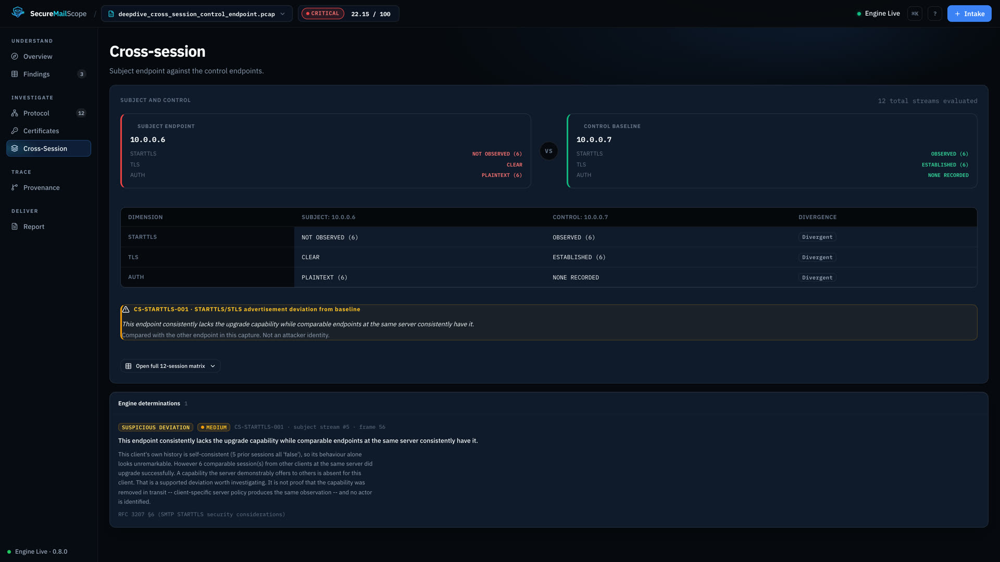
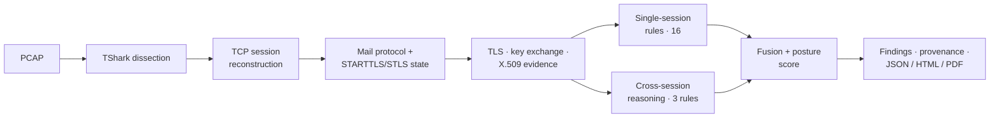
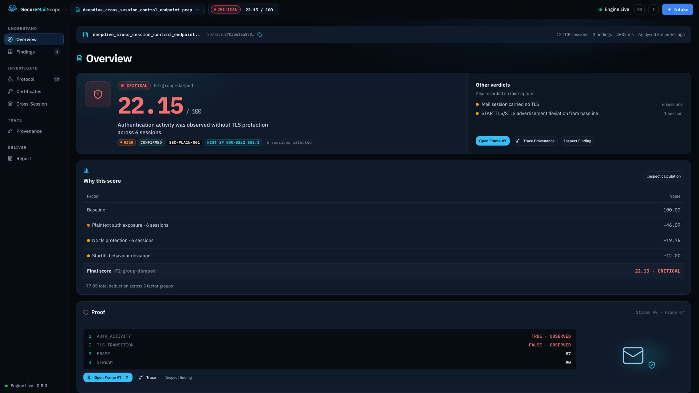
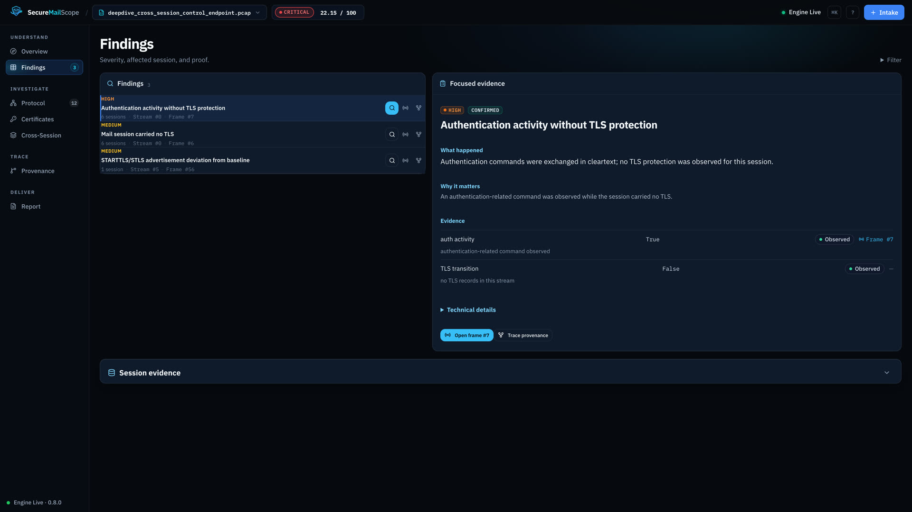
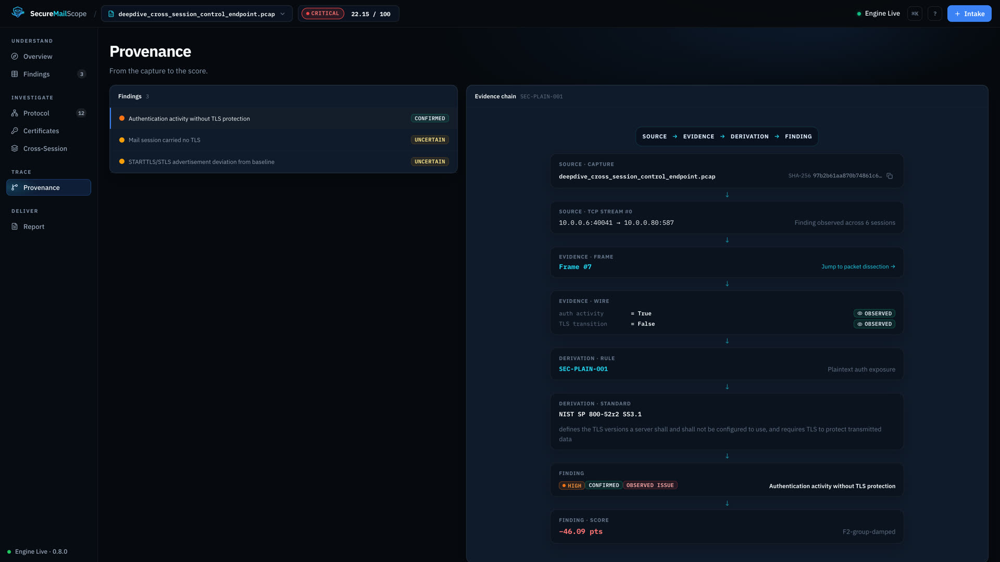
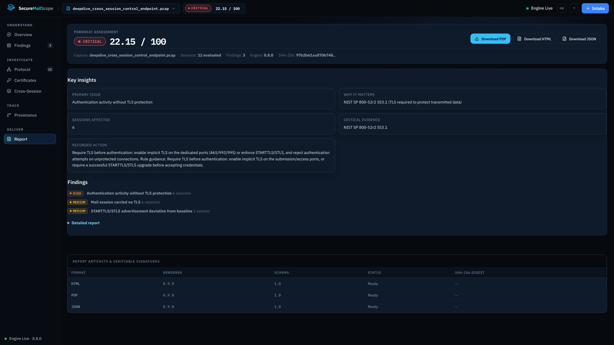
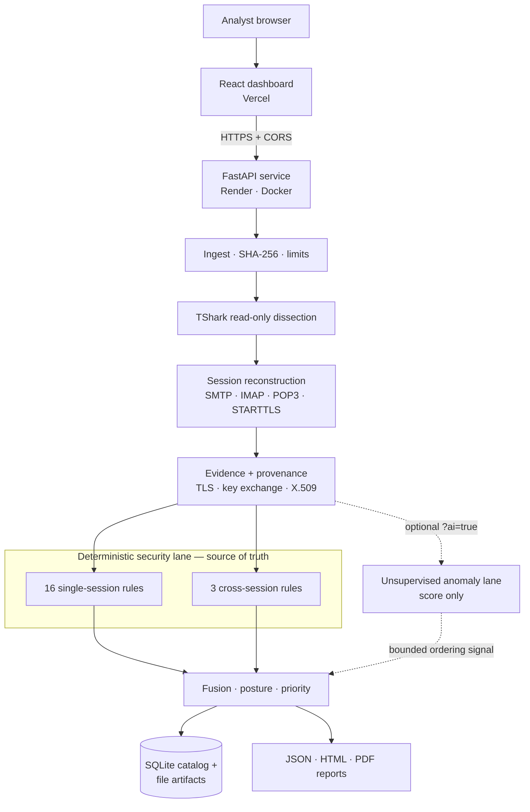

# SecureMailScope

**Passive PCAP analysis of the cryptographic security posture of secure email — reasoning across sessions, not just parsing packets.**

| | |
|---|---|
| **Problem statement** | [SIH26159](https://sih.gov.in/sih2026PS) — *SecureMailScope: AI-Assisted Cryptographic Security Posture Assessment for Secure Email Communications* |
| **Organization** | National Technical Research Organisation (NTRO) |
| **Category / Theme** | Software · Blockchain & Cybersecurity |
| **Release** | `v0.7.1-sih-final` (engineering freeze) + deployment adaptation on `main` |

### 🚀 [Try the live prototype → secure-mail-scope-psi.vercel.app](https://secure-mail-scope-psi.vercel.app)

Upload a `.pcap` and get a score, evidence-linked findings and a downloadable report. The public instance runs on free-tier hosting with ephemeral storage and no authentication — **use test captures only** (details in [Live deployment](#live-deployment)). Ready-made captures are in [`demo/captures/`](demo/captures/).

<!-- DEMO_VIDEO_URL: add the 🎥 Prototype Demo link here once the video is published (no public demo URL exists in the repository yet). -->



*Real screenshot of the deployed prototype analysing [`deepdive_cross_session_control_endpoint.pcap`](demo/captures/) (SHA-256 `97b2b61a…dbe83`): posture **22.15 / 100 — CRITICAL**.*

---

## What is SecureMailScope?

SecureMailScope reads captured **SMTP, IMAP and POP3** traffic — including implicit-TLS SMTPS/IMAPS/POP3S — and reports the **transport** security posture of the email infrastructure that produced it: TLS version, cipher suite, key exchange, forward secrecy, STARTTLS/STLS upgrade integrity, plaintext exposure, insecure configuration, X.509 properties where a cleartext handshake exposes them, and what the capture genuinely could not establish.

It is **passive and offline by design**: it never connects to a mail server, needs no keys or mailbox access, performs no decryption, and does not read message content.

## The problem

TLS protects email content, but it does not tell an analyst whether the security protecting that traffic is sound. Obsolete TLS versions, weak ciphers, STARTTLS that is silently skipped, and misconfigured certificates leave SMTP/IMAP/POP3 deployments open to downgrade and interception — yet general packet tools (Wireshark, TShark) decode protocols without judging posture. The evidence is also scattered: protocol state, the TLS handshake, certificates and **other sessions** each hold part of the picture.

## How it works



1. **Ingest & dissect** — the upload is hashed (SHA-256) and parsed read-only with `tshark -r <file> -T ek` (argument array, no shell).
2. **Reconstruct** — TCP streams become protocol sessions with an explicit STARTTLS/STLS state machine.
3. **Extract evidence** — every fact is wrapped with an evidence state, frame reference and provenance (see [Evidence & provenance](#evidence--provenance)).
4. **Judge deterministically** — 19 versioned, standards-bound rules (16 single-session + 3 cross-session), each cited to an RFC or NIST publication.
5. **Fuse & score** — findings become one `PostureAssessment` (score 0–100, band, coverage, prioritised remediation). Everything downstream consumes it and recomputes nothing.
6. **Report** — the same assessment is projected to a dashboard and to JSON, HTML and PDF reports.

## Why cross-session reasoning?

| | Question it answers |
|---|---|
| **Single-session analysis** | *What happened in this connection?* |
| **Cross-session reasoning** | *How does this connection behave relative to related sessions, or to a control population?* |

A client that never upgrades to TLS looks unremarkable on its own — 5 sessions out of 5 with no STARTTLS is simply consistent. The same behaviour becomes informative when **other clients at the same server** do upgrade. Comparisons are only made between genuinely comparable sessions (same client, server, port, protocol, TLS mode), against prior history only, and the engine **abstains** below a minimum history.

**The demonstrated scenario** ([`deepdive_cross_session_control_endpoint.pcap`](demo/captures/), 12 SMTP sessions to one server):

| | Subject `10.0.0.6` | Control `10.0.0.7` |
|---|---|---|
| STARTTLS | not observed (6 sessions) | observed (6 sessions) |
| TLS | none — clear | established (TLS 1.3) |
| Authentication | plaintext (6 sessions) | none recorded |

The engine reports `CS-STARTTLS-001` as a **deviation worth investigating**. It deliberately does **not** claim an attack or an attacker: a client-specific server policy produces identical bytes, and a capture alone cannot tell the two apart. With **no** control endpoint (`deepdive_cross_session_no_control.pcap`), the same behaviour is reported `COMPLIANT` together with an explicit statement of what passive evidence cannot rule out. Full walkthrough with verbatim engine output: [`docs/finalization/06-cross-session-demo.md`](docs/finalization/06-cross-session-demo.md).

## What an analyst sees



Seven views: **Overview** (score, why-this-score, proof, observability boundary) · **Findings** · **Protocol** (per-stream journey) · **Certificates** · **Cross-Session** · **Provenance** · **Report**. For the capture above the score is `100 − 46.09 (plaintext authentication) − 19.75 (no TLS) − 12.00 (STARTTLS deviation) = 22.15`, every deduction traceable to a rule, frame and standard.

<details>
<summary>More screenshots (Findings · Provenance · Report)</summary>





</details>

## Evidence & provenance

SecureMailScope separates **what the capture establishes** from **what it cannot**. Every extracted fact carries one of six production `EvidenceState` values:

| State | Meaning |
|---|---|
| `OBSERVED` | directly present in the captured bytes |
| `INFERRED` | deduced from observed facts, with the basis recorded |
| `UNKNOWN` | insufficient evidence to decide |
| `AMBIGUOUS` | the evidence supports more than one reading |
| `INCOMPLETE` | the capture is truncated at the relevant point |
| `NOT_OBSERVABLE` | structurally impossible to see passively (e.g. a TLS 1.3 certificate, RFC 8446 §2) |

Silent conversions such as `UNKNOWN → SECURE` or `NOT_OBSERVABLE → FALSE` are forbidden by the evidence wrapper. `UNKNOWN` never improves a score, and a capture that shows too little yields `INSUFFICIENT_EVIDENCE`, not a good grade. *(Related but distinct vocabularies: `FindingStatus` includes `INSUFFICIENT_EVIDENCE`; baseline outcomes include `NOT_APPLICABLE`.)*

**Traceability** — each assessment can be followed from its source:

```
PCAP SHA-256 (= capture_id) → TCP stream / frame / timestamp → evidence (state + provenance)
   → rule + standard → finding → posture score → assessment_id → report_sha256
```

This is forensic provenance and assessment traceability — **not** a legal chain-of-custody claim. The same capture + versions yield identical evidence and findings; reports are deterministic, so the same assessment always renders to the same bytes.

## AI/ML: bounded by design

The **deterministic security lane** (rules, cross-session reasoning, scoring) is the single source of every fact, finding and score. A **secondary ML lane** — an unsupervised robust-z-score anomaly model — emits only an anomaly score, band and feature attribution. By construction it can re-order findings *within* a severity tier and can never create, raise or lower a security finding or change the posture score. Score and band are identical with the lane on or off; when it is on, the assessment may additionally carry a clearly labelled, non-penalising anomaly-signal entry and a model summary.

We evaluated it honestly and the repository reports the result: across every held-out split and every capture the project holds, the lane currently shows **no independent detection value** ([ADR-0015](docs/architecture/adr/0015-ml-model-selection.md), [`docs/architecture/17-ml-model-evaluation.md`](docs/architecture/17-ml-model-evaluation.md)). The lane is off by default (`POST /api/v1/analyses?ai=true` enables it), including in the public prototype. SecureMailScope makes no claim that AI detects attacks or produces the score.

## Key capabilities

| Capability | Status |
|---|---|
| SMTP / IMAP / POP3 identification and session reconstruction, incl. implicit TLS | Implemented |
| STARTTLS / STLS detection and integrity (upgrade outcome, advertisement, plaintext exposure) | Implemented |
| TLS version, cipher suite, key exchange, forward secrecy, insecure-configuration checklist | Implemented |
| X.509 extraction, key algorithm/size, signature algorithm, expiry, chain *structure* | Implemented **where the handshake is cleartext** (TLS ≤ 1.2); TLS 1.3 → `NOT_OBSERVABLE` |
| Certificate chain **trust and revocation** | Not assessed — a passive capture has no trust anchor or OCSP/CRL access |
| Cross-session baseline + control-endpoint reasoning | Implemented (3 rules; abstains on thin history) |
| Posture score, prioritisation, remediation guidance | Implemented (deterministic) |
| Unsupervised anomaly lane | Implemented, bounded, off by default |
| JSON / HTML / PDF reports | Implemented |
| Interactive analyst dashboard | Implemented (React/TypeScript) |

## Reports

`GET /api/v1/analyses/{run_id}/reports/{json|html|pdf}` — all rendered from one canonical report model:

- **JSON** — the structured, canonical assessment (score, band, coverage, findings with evidence references, standards, limitations).
- **HTML** — a single standalone file with no script, CDN or webfont; opens from disk and prints cleanly.
- **PDF** — composed with ReportLab from the same report model (not from the HTML).

Rendering is byte-deterministic and each report is identified by `report_sha256`. The timestamp shown is the analysis time. Details: [`docs/architecture/22-forensic-reporting.md`](docs/architecture/22-forensic-reporting.md).

## Architecture



A deeper component-by-component description is in [`docs/architecture/ARCHITECTURE.md`](docs/architecture/ARCHITECTURE.md).

## Security & privacy

Verified against the source and the final security audit ([`docs/finalization/13-final-security-audit.md`](docs/finalization/13-final-security-audit.md)):

- **Passive** — analysis reads an uploaded file only; no live capture, no active probing, no outbound network calls in `src/securemailscope/`.
- **No decryption, keys or mailbox access** — message content is not read; credential values are not extracted.
- **Hostile-input handling** — TShark is invoked with an argument array (never `shell=True`) under a timeout; upload size, concurrency, queue and analysis-time limits are enforced; download filenames are generated from `assessment_id`, not from the uploaded name; HTML reports escape all content.
- **No authentication** — this is a single-analyst prototype ([ADR-0011](docs/architecture/adr/)). The backend binds to loopback by default; do not expose it publicly with sensitive captures.

## Validation

| Check | Result | Basis |
|---|---|---|
| Backend test suite (`PYTHONPATH=src python3 -m pytest -q`) | **1234 passed**, 0 failed (Python 3.9, TShark 4.6.8) | re-run on `main` for this README |
| Frontend `npm run build` / `npx oxlint` | build succeeds · 0 errors (a few style warnings) | re-run on `main` for this README |
| Golden case B — `deepdive_cross_session_control_endpoint.pcap` | 22.15 · CRITICAL | reproduced on the live deployment |
| Golden case A — `backup_weak_certificate.pcap` | 44.0 · CRITICAL (RSA-1024 / SHA-1 certificate) | [final freeze](docs/releases/SECUREMAILSCOPE-FINAL-ENGINEERING-FREEZE.md); reproduced in the Docker image ([acceptance](docs/deployment/DEPLOYMENT-ACCEPTANCE.md)) |
| Golden case C — `scene_b_certificate_honesty.pcap` | 100.0 · STRONG (TLS 1.3; certificate `NOT_OBSERVABLE`, never "invalid") | final freeze |
| Negative cross-session — `deepdive_cross_session_no_control.pcap` | 34.15 · CRITICAL, with an explicit stated limitation | final freeze |
| AI lane on vs. off | identical posture and score | [`demo/expected/`](demo/expected/scene_c_no_ai_equivalence.json) |

Hostile-payload, path-traversal and report-injection regressions are part of the suite. Research captures and the experiments behind the design decisions are indexed in the [research index](docs/research/00-research-index.md).

## Live deployment

| Component | Where | Stack |
|---|---|---|
| Frontend | [Vercel](https://secure-mail-scope-psi.vercel.app) | React 19 · TypeScript · Vite (static build) |
| Backend API | [Render](https://securemailscope-api-lahb.onrender.com/api/v1/health) (Docker, Free plan) | FastAPI · Uvicorn · Ubuntu 24.04 + TShark 4.6 |
| Storage | container filesystem | SQLite catalog + file artifacts under `/data` |

The frontend talks directly to the backend over HTTPS (CORS allow-list via `SMS_ALLOWED_ORIGINS`). **The public deployment is a prototype constraint, not the analysis engine's design:** Render Free has no persistent disk, so stored analyses can disappear after a restart or redeploy, and an idle instance may sleep so the first request can be slow. There is no authentication — analyse test captures only. See [`docs/deployment/`](docs/deployment/DEPLOYMENT-ARCHITECTURE.md).

## Technology stack

| Layer | Technology | Role |
|---|---|---|
| Analysis core | Python ≥ 3.9, standard library only | evidence model, sessions, rules, cross-session, posture (zero runtime dependencies) |
| Packet dissection | TShark (validated against 4.6.x) | read-only PCAP dissection |
| API | FastAPI, Pydantic, Uvicorn | upload, jobs, assessment, report endpoints |
| Storage | SQLite + file artifacts | run catalog, content-addressed reports |
| Reports | stdlib (JSON, HTML) · ReportLab (PDF) | forensic reports |
| ML lane | Python (robust-z-score model; scikit-learn models evaluated) | secondary anomaly signal |
| Frontend | React 19, TypeScript, Vite, IBM Plex (self-hosted) | analyst dashboard |
| Packaging | Docker (Ubuntu 24.04), Render Blueprint, Vercel | deployment |
| Testing | pytest (+ httpx, pypdf) | 1234 backend tests |

## Quick start

**Prerequisites:** Python ≥ 3.9, **TShark** on `PATH` (`tshark --version`; developed against 4.6.8 — other versions can change dissection output), Node ≥ 18.

```bash
git clone https://github.com/Sidd927/SecureMailScope.git && cd SecureMailScope
python3 -m pip install 'fastapi>=0.110' 'pydantic>=2' 'uvicorn>=0.27' 'python-multipart>=0.0.9' 'reportlab>=4'
```

**Terminal 1 — backend (port 8001):**

```bash
PYTHONPATH=src python3 -m securemailscope.backend --host 127.0.0.1 --port 8001
```

**Terminal 2 — frontend (port 5173, proxied to 8001):**

```bash
cd frontend && npm ci && npm run dev
```

Open <http://localhost:5173>; the header shows **Engine Live** when the backend is reachable (**Demo Fixture** if not). Then upload a file from [`demo/captures/`](demo/captures/), or use the API directly:

```bash
curl -s -F file=@demo/captures/deepdive_cross_session_control_endpoint.pcap http://127.0.0.1:8001/api/v1/analyses
```

Run the tests (tests needing TShark or optional extras skip cleanly):

```bash
python3 -m pip install pytest httpx pypdf
PYTHONPATH=src python3 -m pytest -q
```

`pip install -e .` is unreliable on some system pips — use `PYTHONPATH=src`. Configuration is through `SMS_*` environment variables (`SMS_DATA_DIR`, `SMS_ALLOWED_ORIGINS`, `SMS_MAX_UPLOAD_BYTES`, `SMS_MAX_ANALYSIS_SECONDS`, …; see [`docs/architecture/21-backend-persistence-api.md`](docs/architecture/21-backend-persistence-api.md)). A backend-only analyst console is also served at `/dashboard/`.

### Docker

The [`Dockerfile`](Dockerfile) (Ubuntu 24.04 + TShark 4.6 from the Wireshark PPA) is what the public backend runs. TShark's version is pinned deliberately because a different version was found to change scores on the project's golden captures.

```bash
docker build -t securemailscope .
docker run --rm -p 8000:8000 -e PORT=8000 securemailscope
curl http://localhost:8000/api/v1/health        # expect "tshark":"available"
```

State lives in `/data` inside the container (add a volume to persist it). Full deployment steps: [`docs/deployment/DEPLOYMENT-RUNBOOK.md`](docs/deployment/DEPLOYMENT-RUNBOOK.md).

## Repository structure

```
src/securemailscope/   analysis core and backend
  dissect/ session/ evidence/ analysis/ crypto/ crosssession/ ml/ posture/ reporting/ ingest/ backend/ dashboard/
frontend/              React + TypeScript analyst dashboard
tests/                 1234 backend tests (incl. golden, adversarial, report, security)
demo/                  demo captures, expected outputs, pre-rendered reports, runbook
research/experiments/  captures and scripts behind the research and ML evaluation
docs/                  architecture, research, deployment, releases (start at docs/README.md)
Dockerfile, render.yaml   backend container and Render blueprint
```

## Documentation

Start at the **[documentation index](docs/README.md)**. Highlights:

| Need | Read |
|---|---|
| Architecture | [`docs/architecture/ARCHITECTURE.md`](docs/architecture/ARCHITECTURE.md) |
| Requirement-by-requirement SIH status | [`docs/phase12/01-final-requirements-audit.md`](docs/phase12/01-final-requirements-audit.md) |
| Evidence states & provenance contract | [`docs/architecture/04-evidence-provenance.md`](docs/architecture/04-evidence-provenance.md) |
| Cross-session reasoning | [`docs/architecture/14-cross-session-reasoning.md`](docs/architecture/14-cross-session-reasoning.md) |
| Rule catalogues | [`13`](docs/architecture/13-rule-catalog.md) · [`15`](docs/architecture/15-cross-session-rule-catalog.md) |
| Judge Q&A | [`docs/phase12/11-judge-question-bank.md`](docs/phase12/11-judge-question-bank.md) |
| Final validation | [`docs/releases/`](docs/releases/SECUREMAILSCOPE-FINAL-SYSTEM-VALIDATION.md) |

## Limitations

- **Passive evidence has hard limits.** TLS 1.3 encrypts certificates, so they are reported `NOT_OBSERVABLE`. Certificate *chain structure* is validated; *trust* and *revocation* are not (no trust anchor or OCSP/CRL in a PCAP) — requirement D-11 is therefore only partially met, by design.
- **Cross-session reasoning needs context.** It requires comparable prior history (default ≥ 5 sessions) and, for a stronger signal, a control endpoint; otherwise it abstains. Consistent stripping at every client is passively indistinguishable from server policy.
- **The ML lane adds no demonstrated detection value** on the data this project holds (see above); it is a bounded prioritisation signal only.
- **No authentication, ephemeral public storage.** The prototype is single-analyst; the hosted instance loses history on restart.
- **TShark-version sensitive.** Results were validated against TShark 4.6.x.
- **Scale untested.** The pipeline runs synchronously inside the request (one concurrent analysis by default); only small captures have been exercised.
- **Known backend debt:** a shared SQLite connection can fail under overlapping requests; the frontend serialises requests as a mitigation ([`TECH-DEBT.md`](TECH-DEBT.md) #10).
- **Frontend has no automated unit tests** (build, lint and scripted browser checks only).
- **Bundled demo captures are synthetic SMTP/lab-generated.** IMAP/POP3 are implemented and tested; sample captures are under `research/experiments/oq28/pcaps/`.

## SIH26159 alignment

Checked against the official portal. Full requirement-by-requirement audit: [`docs/phase12/01-final-requirements-audit.md`](docs/phase12/01-final-requirements-audit.md).

| Official objective / deliverable | Status |
|---|---|
| Passive analysis of SMTP, IMAP, POP3 from PCAP; protocol identification; TCP stream reconstruction | ✅ |
| STARTTLS negotiation detection and validation; TLS handshake reconstruction | ✅ |
| Negotiated TLS version, cipher suite, key-exchange mechanism; forward-secrecy assessment | ✅ |
| Weak/deprecated algorithms and insecure configuration detection | ✅ |
| X.509 extraction; expiry, key algorithm/length, signature algorithm | ✅ where the handshake is cleartext (TLS 1.3 → `NOT_OBSERVABLE`) |
| Certificate chain validation | ⚠️ structure validated; trust/revocation not possible passively |
| Cryptographic risk classification, posture scoring, prioritisation, mitigation advice | ✅ deterministic engine |
| AI/ML anomaly detection | ⚠️ implemented as a bounded unsupervised lane; no independent detection value demonstrated |
| Forensic reports (JSON, HTML, PDF) and interactive dashboard | ✅ |

## License

No license has been selected for this repository yet.
