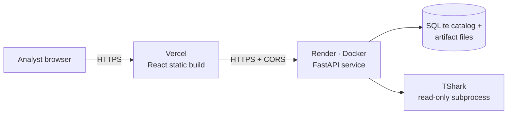
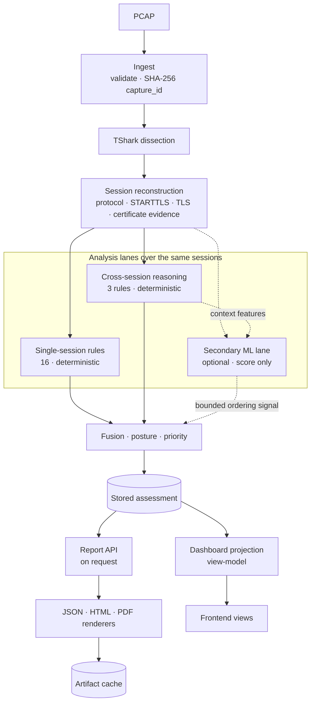

# SecureMailScope — Architecture

A public-facing overview of how the system is built. It describes what is **implemented** at `main` (engine frozen at `v0.7.1-sih-final`, plus the Vercel/Render deployment adaptation). Deep design records live in the numbered documents and ADRs linked below; they are phase-by-phase records and are kept as written.

## 1. Design principles

1. **Deterministic security reasoning is the ground truth.** Every fact, finding and score comes from versioned, standards-bound rules.
2. **Never claim more than the capture supports.** Facts carry an evidence state; absence of evidence is never converted into safety or into an attack.
3. **One canonical answer.** `PostureAssessment` is produced once; the API, dashboard and reports consume it and recompute nothing.
4. **ML is a bounded, secondary lane** that can influence ordering only.
5. **Passive and reproducible.** The same capture analysed with the same versions yields the same evidence, findings and `assessment_id`. Report bytes are stable for a given *stored assessment* (see [Reports and identity](#reports-and-identity)).

## 2. The journey, end to end

**PCAP → session reconstruction → protocol/TLS evidence → cross-session reasoning → deterministic findings → posture → provenance → reports.**

In the implementation, single-session rules and cross-session reasoning run side by side over the same reconstructed sessions; their findings are fused into one posture assessment, which is stored. Reports and the dashboard view are then produced *from the stored assessment* on request.

### Deployment view



Two services on two origins: the frontend calls the backend directly (no proxy), because analysis runs synchronously inside the upload request and a proxy timeout would cut off slow captures ([why](../deployment/DEPLOYMENT-ARCHITECTURE.md)). On the public deployment the storage is ephemeral.

### Analysis view



`evidence/` and `crypto/` are packages (data model and parsing helpers) used inside session reconstruction and the rules, not separate pipeline stages. Report rendering and the dashboard projection are **not** analysis stages: they read the stored assessment and add no conclusions.

## 3. Components

### Frontend — `frontend/`
React 19 + TypeScript + Vite, built to static assets. It renders the backend's canonical assessment and dashboard view-model; the security conclusions come from the backend engine. Views: Overview, Findings, Protocol, Certificates, Cross-Session, Provenance, Report. The API base URL is `VITE_API_BASE_URL` at build time (default `/api/v1`, proxied to `127.0.0.1:8001` by the Vite dev server).

**Demo fixtures.** The UI falls back to labelled demo fixtures in two cases: the backend is unreachable, **or** the backend is reachable but has no stored runs. The amber **Demo Fixture** badge therefore does not by itself mean the backend is down; **Engine Live** appears once real runs exist.

### API layer — `src/securemailscope/backend/`
FastAPI modular monolith (`api`, `service`, `pipeline`, `repository`, `artifacts`, `lifecycle`, `limits`). Endpoints: health, submit (`POST /api/v1/analyses`, `?ai=true` optional), list/get runs, assessment, sessions, dashboard view-model, artifacts, reports. The job lifecycle is an explicit state machine (`CREATED → VALIDATING → QUEUED → RUNNING → FINALIZING → COMPLETED`, or `FAILED`/`CANCELLED`) with a `run_events` audit trail; interrupted runs are never reported `COMPLETED`. Limits (upload size, concurrent analyses = 1, queue depth, analysis time) are set through `SMS_*` environment variables. CORS is opt-in via `SMS_ALLOWED_ORIGINS`. A static analyst console is also served at `/dashboard/`.

### Ingest and TShark — `ingest/`, `dissect/`
`ingest` validates the file and computes its **SHA-256, the `capture_id`**, enforcing size and frame limits before parsing. TShark is the only external dependency of the analysis path: it is run read-only (`tshark -r <file> -T ek`) with an argument array (never `shell=True`), a timeout and a version check. The adapter normalises TShark fields into a canonical frame-evidence schema so no other module sees TShark field names. Results were validated against TShark 4.6.x; other versions can change dissection output, which is why the container pins it.

### Session reconstruction and protocol state — `session/`
Frames are grouped into TCP streams and then protocol sessions by separate **SMTP**, **IMAP** and **POP3** reconstructors. A per-session STARTTLS/STLS state machine records advertisement, request, acceptance, TLS transition, plaintext continuation and authentication activity. Implicit-TLS ports (SMTPS/IMAPS/POP3S) are a separate mode and never pooled with explicit-TLS sessions.

### Cryptographic and certificate evidence — `crypto/`
TLS version, cipher suite, key-exchange mechanism and forward secrecy come from the handshake. X.509 certificates are parsed (public-key algorithm and size, signature algorithm, **certificate validity period**, **certificate chain linkage**) **only where the handshake is cleartext**. TLS 1.3 encrypts the Certificate message (RFC 8446 §2), so those sessions report the certificate as `NOT_OBSERVABLE`. **Chain trust is not assessed and revocation is not assessed** — a passive capture carries no trust anchor and no OCSP/CRL access — so a chain is reported as linked or not linked, never as "trusted" or "valid".

### Evidence model — `evidence/`

A set of distinct fields, not a pipeline stage:

| Concept | What it is | Values |
|---|---|---|
| `EvidenceState` | the epistemic state of a fact | `OBSERVED` · `INFERRED` · `UNKNOWN` · `AMBIGUOUS` · `INCOMPLETE` · `NOT_OBSERVABLE` |
| Origin `Provenance` | a separate origin enum, used for certificate-class facts | `observed` · `inherited` · `historical` · `retrieved` · `decrypted` (default `none`) |
| Frame references | the packet frames an `EvidenceField` points to | frame numbers; streams and capture timestamps live on the session and event records |

Invariants are enforced when a field is built (for example `OBSERVED` must carry a value and `INFERRED` must record its basis), and silent conversions such as `UNKNOWN → SECURE` or `NOT_OBSERVABLE → FALSE` are forbidden. `retrieved` and `decrypted` exist only as labels for optional non-passive modes; the current passive pipeline never sets them. Contract: [04](04-evidence-provenance.md).

### Deterministic security engine — `analysis/`
16 versioned single-session rules (TLS version, handshake completion, certificate extraction/validity/key strength/signature/chain structure, forward secrecy, key exchange, insecure-configuration checklist, STARTTLS/STLS outcome and advertisement, implicit TLS, cleartext authentication, no-TLS sessions). Each rule states the evidence it consumes, its RFC/NIST citation, its outcomes and its own limitations. Catalogue: [13](13-rule-catalog.md).

### Cross-session reasoning — `crosssession/`
**Why it exists.** A single passive capture can contain byte-identical evidence for a server that genuinely does not support STARTTLS and for a session where STARTTLS was stripped. One session cannot tell them apart. Comparing related sessions — the same client's prior history, or a control endpoint at the same server — adds context that can surface a **deviation worth investigating**. It does *not* by itself prove stripping, does not establish attacker attribution, and does not infer an attacker identity; with no control endpoint the engine says so explicitly.

**How.** `comparability → baseline → contrast → findings`. Sessions are compared only if comparable (client, server, port, protocol, TLS mode); the baseline uses prior history only; the engine abstains below a minimum history and when history is inconsistent; a control is a session to the same server from a different client. Three rules: `CS-STARTTLS-001` (advertisement deviation), `CS-STARTTLS-002` (upgrade deviation), `CS-TLS-001` (version deviation). Design: [14](14-cross-session-reasoning.md), catalogue: [15](15-cross-session-rule-catalog.md).

### Secondary ML lane — `ml/`
Optional (`?ai=true`), off by default. An unsupervised robust-z-score model emits an anomaly score, band and feature attribution. It is **secondary** and reuses the deterministic cross-session context — comparability, baseline and contrast results — as feature inputs, so it is not independent of that reasoning. It cannot create or change a finding or the posture score, and its ordering adjustment is smaller than the gap between severity tiers. [ADR-0015](adr/0015-ml-model-selection.md) found **no independent detection value** on the evaluated held-out splits. See [16](16-ml-anomaly-architecture.md), [17](17-ml-model-evaluation.md).

### Posture engine — `posture/`
Fuses session facts and both kinds of findings into issue groups, then computes the score (`F2-group-damped`: one penalty per issue group with damped recurrence), the band (`STRONG ≥ 90`, `ADEQUATE ≥ 75`, `WEAK ≥ 50`, otherwise `CRITICAL`), evidence coverage, prioritisation and remediation guidance. If fewer than 50 % of sessions are assessable it declines to certify a band and returns the posture band `INSUFFICIENT_EVIDENCE` rather than a good grade. Design: [19](19-evidence-fusion-and-posture.md).

### Dashboard projection — `dashboard/`
`dashboard/projection.py` reorganises the stored assessment into the view-model the frontend consumes. It copies severities, scores and states out of the canonical document and never reinterprets them; it is a presentation layer, not part of the forensic analysis. Design: [23](23-dashboard-architecture.md).

### Persistence — `backend/db.py`, `backend/artifacts.py`
One SQLite catalog (`runs`, `assessments`, `artifacts`, `run_events`) in WAL mode plus a content-addressed file store under `SMS_DATA_DIR`. The canonical assessment is stored as a document; projections (posture, score) are for listing only and never read back as authority. A reproduced assessment keeps its first stored document and fails closed if content diverges ([ADR-0017](adr/0017-backend-storage-supersession.md)).

### Reports and identity
`GET /api/v1/analyses/{run_id}/reports/{json|html|pdf}` renders a report **from the stored assessment, on request**, and the rendered artifact is cached as a content-addressed file. JSON is the canonical report model, HTML is a standalone file (no script, CDN or webfont), and PDF is composed with ReportLab from the same model. Rendering is a pure function of the stored assessment, so **the same stored assessment yields the same report bytes** and the same `report_sha256`. A report includes the analysis time (`generated_at`), so a *fresh* analysis run of the same capture can carry a different timestamp and therefore different report bytes, even though its evidence, findings and `assessment_id` are the same. Design: [22](22-forensic-reporting.md).

## 4. Provenance chain

An engineering provenance chain from the uploaded bytes to the report — **not** a legal chain of custody:

```
PCAP SHA-256
  → capture_id                       (the same digest)
  → frame / TCP-stream references    (capture timestamps are kept on session and event records)
  → evidence                         (EvidenceState + frame references)
  → finding                          (rule + standard citation)
  → posture                          (score, band, coverage)
  → assessment_id                    (content-addressed hash of the conclusion)
  → report_sha256                    (hash of a rendered report)
```

`run_id` (one execution) is a separate identity. `assessment_id` hashes `capture_id`, the schema version and each issue group's class, fact kind, severity and recurrence, and deliberately excludes `run_id` and timestamps. The Provenance view renders `capture → stream → frame → wire evidence → rule → standard → finding → score`. Identity measurements: [21 §7](21-backend-persistence-api.md).

## 5. Security boundaries

Passive file analysis only; no outbound calls from the core; hostile filenames never reach the filesystem; reports escape all content. There is **no authentication** — a single-analyst prototype, loopback by default ([ADR-0011](adr/0011-backend.md)); the public instance should be used with test captures only. Implementation audit: [`../finalization/13-final-security-audit.md`](../finalization/13-final-security-audit.md).

## 6. Further reading

| Topic | Document |
|---|---|
| Status and map of all design records | [ARCHITECTURE_STATUS](ARCHITECTURE_STATUS.md) (historical for Phases 1–10) |
| Data model, session reconstruction | [03](03-data-model.md), [11](11-session-reconstruction.md) |
| Security analysis & rules | [12](12-security-analysis.md), [13](13-rule-catalog.md) |
| Backend, persistence, API | [21](21-backend-persistence-api.md) |
| X.509 / key exchange / forward secrecy | [`../phase11/05-architecture.md`](../phase11/05-architecture.md) |
| Decision records | [`adr/`](adr/) |
| Requirement traceability | [requirements-traceability](requirements-traceability.md) |
| Deployment topology | [`../deployment/DEPLOYMENT-ARCHITECTURE.md`](../deployment/DEPLOYMENT-ARCHITECTURE.md) |
| Threat model (draft security-review design record) | [06](06-threat-model.md) |
